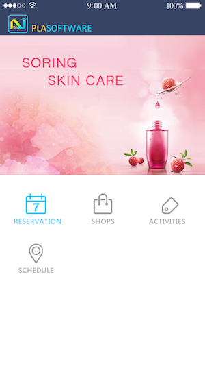

#个人简介
*   985，211高校，工科背景，2年技术开发经验，一年后端，一年前端。
*   有较强的自学能力，乐于尝试新技术。
*   纯理性思维者，爱弹吉他。

#技术经历
*   框架：MVC, MVVC
*   布局：AutoLayout, SizeClass
*   数据：CodeData, Realm, XML, JSON解析
*   传值；Delegate, block, KVO, 单例, 属性
*	线程：GCD, NSOperationQueue
*	自定义控件：xib, storyboard可视化编程

#项目技术细节
######	  互惠中国

*  简介：
	*  [中冶集团的p2p理财平台](http://www.huhuizg.com/)，iOS端的开发   
	*  通过转盘进入不同的tab，排行榜是通过UITableView展示的商品列表，理财课堂进入在线视频流播放，最		新活动进入UIWebView相对应的网页，收益列表显示账户的投资收益

*   语言：Objective-C
*   功能：理财商城，订单，三方登陆、分享，支付
*   三方库：AFNetworking, SDWebImage, ProgressHUD, ShareSDK

######	  美容院

*	简介：越南的外包项目
	*	美容院预约系统，后台集成现有的.Net后台进行接口封装
	*	主要有3个功能，建立预约，取消预约，预约历史
	*	最大的困难是语言的Localization，iOS前端的好配置，后端集成很麻烦，现有的http协议显示乱码，中途尝试过用.Net直接socket通讯，最终解决
*   语言: Swift
*   功能：建立、查看、取消预约，fabric手机验证
*   三方库：Fabric, Alamofire, ObjectMapper, ActionSheetPicker, Refresher
 

######		喵喵客

[链接](https://itunes.apple.com/cn/app/miao-miao-ke-tou-zi-li-cai/id977918033?mt=8)

*	简介：
	* 	[喵喵客](http://www.miaomiaobank.com/)的iOS版本
	*	自定义手势实现Tab的转换，JS端通过WKWebView的代理方法进行交互调用Native的分享页面，通过UIPageViewController实现同一页面多个UITableView的切换和数据加载，使用连连支付的接口实现移动支付
*	语言：Swift, Objective-C
*	功能：商品展示，支付，分享，手机验证，排序
*	三方库：SDWebImage, AFNetworking, MJRefresh

#其他开源项目和个人作品
+ [美术馆](https://github.com/zxtcko/artMuseum)

+ [CustomEcho](https://github.com/zxtcko/customEcho)

+ [TripTree](http://www.chriscoder.me/ionic/TripTree/www/index.html)

 

#理想团队
+   高效
+   有大牛